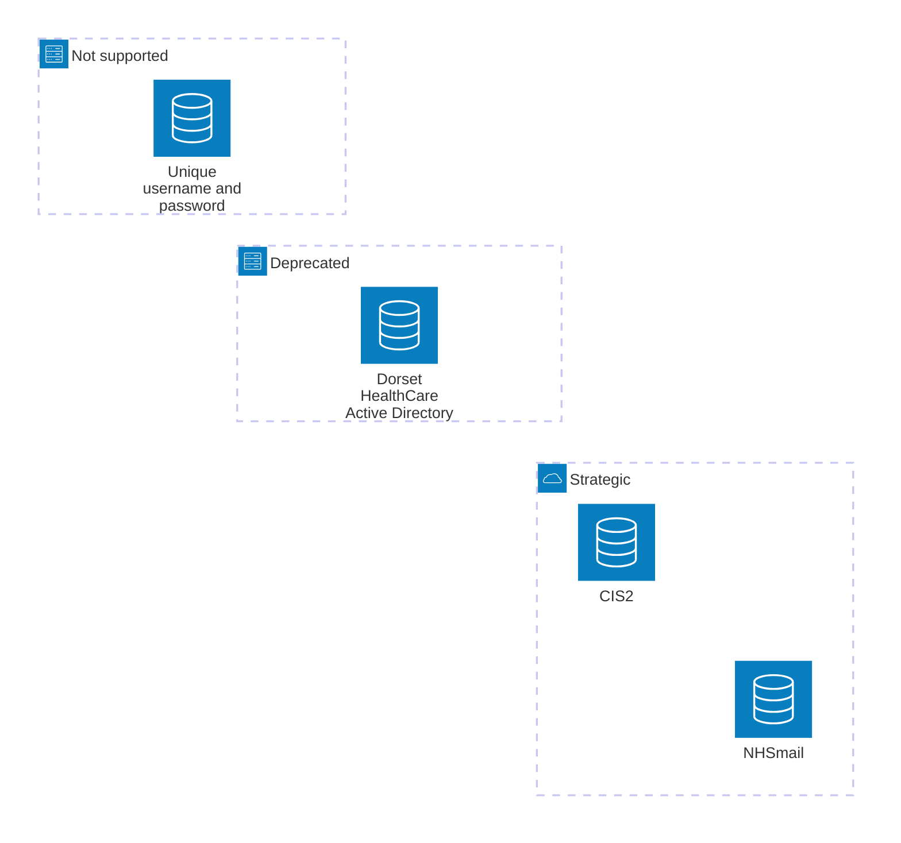

 

# Identity and access management standard

There are several authentication providers in use within the organisation.

## Strategic authentication provider - NHSmail
The NHSmail Entra ID (previously known as Azure Active Directory) is the organisation's main strategic identity provider, that shall be used in the authentication of all newly procured digital solutions where CIS2 is not required. Identities in this directory end with the suffix _@nhs.net_. The NHSmail Entra ID directory is configured in line with Microsoft best practice and is monitored twenty-four hours a day by the NHS England cyber security operations centre (CSOC). All Dorset HealthCare staff have a NHSmail account, and these are overwhelmingly protected by strong multi-factor authentication in line with the [national multi-factor authentication policy](https://digital.nhs.uk/cyber-and-data-security/guidance-and-assurance/multi-factor-authentication-mfa-policy). NHSmail also provides more opportunities to easily permit access to systems for staff from other organisations in the future.

Where we work with external suppliers and when we internally design and build digital systems, we will work to integrate with the NHSmail Entra ID using modern, standards-based technologies such as [OAuth 2.0](https://oauth.net/2/) and [Security Assertion Markup Language (SAML)](https://xml.coverpages.org/saml.html), or more custom integrations where these are offered by suppliers.

## Strategic authentication provider - CIS2
The [Care Identity Service version 2 (CIS2)](https://digital.nhs.uk/services/care-identity-service/applications-and-services/cis2-authentication) is a secure authentication service provided by NHS England for staff to access national clinical and business systems. It is also used at Dorset HealthCare to provide access to local clinical systems which themselves link to national services such as the [NHS spine](https://digital.nhs.uk/services/spine). CIS2 offers multiple methods of authentication, all of which ensure strong multi-factor authentication in line with the [national multi-factor authentication policy](https://digital.nhs.uk/cyber-and-data-security/guidance-and-assurance/multi-factor-authentication-mfa-policy).

Dorset HealthCare has historically used the NHS smartcard as the primary means of CIS authentication, as this is the only authentication method supported by the legacy Care Identity Service. Legacy CIS is due to be decommissioned in 2027 and suppliers are in the process of migrating their applications to use CIS2. We will investigate the use of the newly available authentication methods (including but not limited to Microsoft Authenticator, which is already widely used in the organisation, and Windows Hello for Business) to enable a move away from smartcards in the future. This will permit future time and efficiency savings as well as enabling the organisation to specify laptop computers without integral smartcard readers which will eventually produce a cost saving. In any consideration of CIS2 authentication methods that rely on cameras and mobile devices we will always consider the needs of staff who work in settings where such devices are not permitted.

## Dorset HealthCare active directory - dhc.nhs.uk
The Dorset HealthCare Entra ID directory is populated from an on-premise Active Directory. Identities in these directories end with the suffix _@dhc.nhs.uk_. The Dorset HealthCare Active Directory is used as an authentication provider by a number of existing digital systems. It is not a strategic authentication provider and may not be used for new applications, except by specific approval from the infrastructure technical design authority (TDA). 

Where the use of the Dorset HealthCare Active Directory as an authentication provider is unavoidable, we will work to integrate with the tenant Entra ID using modern, standards-based technologies such as [OAuth 2.0](https://oauth.net/2/) and [Security Assertion Markup Language (SAML)](https://xml.coverpages.org/saml.html). The Dorset HealthCare Active Directory will also support direct connections over Lightweight Directory Access Protocol (LDAP), commonly known as an **LDAP bind**. Any such connection will require specific approval from the infrastructure technical design authority (TDA).

## Unique username and password
We will not by default procure any digital system that does not integrate with one or other of the above strategic authentication providers. Any deviation from this position will require business justification and specific approval from the infrastructure technical design authority (TDA).